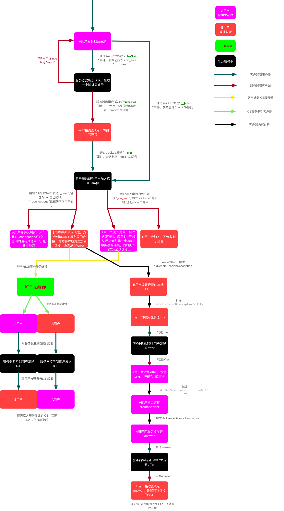

# Socket.io-FLSocketIM-iOS
##### [简书详情介绍地址](http://www.jianshu.com/p/686c4bf6df3f)

###### iOS 代码地址:https://github.com/fengli12321/Socket.io-FLSocketIM-iOS
###### 服务器端代码实现参照:https://github.com/githuanl/node.js-socket.io-server
###### 安卓端代码实现参照:https://github.com/githuanl/socket.io-android-

### 实现功能
1. 文本发送
2. 图片发送（从相册选取，或者拍摄）
3. 短视频
4. 语音发送
5. 视频通话
6. 其他一些效果（类似QQ底部tabBar,短视频拍摄等）
7. 功能扩展中。。。。。


### 使用技术

#### 一、socket.io
[github地址](https://github.com/socketio/socket.io)

socket.io是该项目实现即时通讯关键所在，非常强大；
Socket.io将Websocket和轮询 （Polling）机制以及其它的实时通信方式封装成了通用的接口，并且在服务端实现了这些实时机制的相应代码。

先上代码

###### 1.创建socket连接，通过单例管理类FLSocketManager实现
```
- (void)connectWithToken:(NSString *)token success:(void (^)())success fail:(void (^)())fail {
    
    
    NSURL* url = [[NSURL alloc] initWithString:BaseUrl];
    
    /**
     log 是否打印日志
     forceNew      这个参数设为NO从后台恢复到前台时总是重连，暂不清楚原因
     forcePolling  是否强制使用轮询
     reconnectAttempts 重连次数，-1表示一直重连
     reconnectWait 重连间隔时间
     connectParams 参数
     forceWebsockets 是否强制使用websocket, 解释The reason it uses polling first is because some firewalls/proxies block websockets. So polling lets socket.io work behind those.
     来源：https://github.com/socketio/socket.io-client-swift/issues/449
     */
    SocketIOClient* socket;
    if (!self.client) {
        socket = [[SocketIOClient alloc] initWithSocketURL:url config:@{@"log": @NO, @"forceNew" : @YES, @"forcePolling": @NO, @"reconnectAttempts":@(-1), @"reconnectWait" : @4, @"connectParams": @{@"auth_token" : token}, @"forceWebsockets" : @NO}];
    }
    else {
        socket = self.client;
        socket.engine.connectParams = @{@"auth_token" : token};
    }
    

    // 连接超时时间设置为15秒
    [socket connectWithTimeoutAfter:15 withHandler:^{
        
        fail();
    }];
    
    // 监听一次连接成功
    [socket once:@"connect" callback:^(NSArray * _Nonnull data, SocketAckEmitter * _Nonnull ack) {
        
        success();
    }];
    
    _client = socket;
}
```
这个方法是在用户登录后调用，主要作用是初始化socket连接，关于socket初始化相关参数请参照socket.io文档。

###### 2.监听服务器向客户端发送的消息，通过单例管理类FLClientManager进行管理，然后让代理实现功能
```
// 收到消息
    [socket on:@"chat" callback:^(NSArray * _Nonnull data, SocketAckEmitter * _Nonnull ack) {
        

        if (ack.expected == YES) {
            
            [ack with:@[@"hello 我是应答"]];
        }

        
        FLMessageModel *message = [FLMessageModel yy_modelWithJSON:data.firstObject];
        
        NSData *fileData = message.bodies.fileData;
        if (fileData && fileData != NULL && fileData.length) {
            
            NSString *fileName = message.bodies.fileName;
            NSString *savePath = nil;
            switch (message.type) {
                case FLMessageImage:
                    savePath = [[NSString getFielSavePath] stringByAppendingPathComponent:[NSString stringWithFormat:@"s_%@", fileName]];
                    break;
                case FlMessageAudio:
                    savePath = [[NSString getAudioSavePath] stringByAppendingPathComponent:fileName];
                    break;
                default:
                    savePath = [[NSString getFielSavePath] stringByAppendingPathComponent:fileName];
                    break;
            }
            
            
            message.bodies.fileData = nil;
            [fileData saveToLocalPath:savePath];
        }
        
        
        id bodyStr = data.firstObject[@"bodies"];
        if ([bodyStr isKindOfClass:[NSString class]]) {
            FLMessageBody *body = [FLMessageBody yy_modelWithJSON:[bodyStr stringToJsonDictionary]];
            message.bodies = body;
        }
        
        // 消息插入数据库
        [[FLChatDBManager shareManager] addMessage:message];
        
        // 会话插入数据库或者更新会话
        BOOL isChatting = [message.from isEqualToString:[FLClientManager shareManager].chattingConversation.toUser];
        [[FLChatDBManager shareManager] addOrUpdateConversationWithMessage:message isChatting:isChatting];
        
        
        // 本地推送，收到消息添加红点，声音及震动提示
        [FLLocalNotification pushLocalNotificationWithMessage:message];
        
        
        
        // 代理处理
        for (FLBridgeDelegateModel  *model in self.delegateArray) {
            
            id<FLClientManagerDelegate>delegate = model.delegate;
            if (delegate && [delegate respondsToSelector:@selector(clientManager:didReceivedMessage:)]) {
                
                if (message) {
                    [delegate clientManager:self didReceivedMessage:message];
                }
                
            }
        }
    }];
    
    // 视频通话请求
    [socket on:@"videoChat" callback:^(NSArray * _Nonnull data, SocketAckEmitter * _Nonnull ack) {
        
        UIViewController *vc = [self getCurrentVC];
        NSDictionary *dataDict = data.firstObject;
        FLVideoChatViewController *videoVC = [[FLVideoChatViewController alloc] initWithFromUser:dataDict[@"from_user"] toUser:[FLClientManager shareManager].currentUserID type:FLVideoChatCallee];
        videoVC.room = dataDict[@"room"];
        [vc presentViewController:videoVC animated:YES completion:nil];
        FLLog(@"%@============", data);
    }];
    
    // 用户上线
    [socket on:@"onLine" callback:^(NSArray * _Nonnull data, SocketAckEmitter * _Nonnull ack) {
        
        for (FLBridgeDelegateModel  *model in self.delegateArray) {
            
            id<FLClientManagerDelegate>delegate = model.delegate;
            if (delegate && [delegate respondsToSelector:@selector(clientManager:userOnline:)]) {
                
                [delegate clientManager:self userOnline:[data.firstObject valueForKey:@"user"]];
            }
        }
    }];
    
    // 用户下线
    [socket on:@"offLine" callback:^(NSArray * _Nonnull data, SocketAckEmitter * _Nonnull ack) {
        
        for (FLBridgeDelegateModel  *model in self.delegateArray) {
            
            id<FLClientManagerDelegate>delegate = model.delegate;
            if (delegate && [delegate respondsToSelector:@selector(clientManager:userOffline:)]) {
                
                [delegate clientManager:self userOffline:[data.firstObject valueForKey:@"user"]];
            }
        }
    }];
    

    
    // 连接状态改变
    [socket on:@"statusChange" callback:^(NSArray * _Nonnull data, SocketAckEmitter * _Nonnull ack) {
        
        FLLog(@"%ld========================状态改变", socket.status);
        for (FLBridgeDelegateModel  *model in self.delegateArray) {
            
            id<FLClientManagerDelegate>delegate = model.delegate;
            if (delegate && [delegate respondsToSelector:@selector(clientManager:didChangeStatus:)]) {
                
                [delegate clientManager:self didChangeStatus:socket.status];
            }
        }
    }];

```

`- (NSUUID * _Nonnull)on:(NSString * _Nonnull)event callback:(void (^ _Nonnull)(NSArray * _Nonnull, SocketAckEmitter * _Nonnull))callback;`
socket.io 提供的事件监听方法，这里监听的事件包括：
- “chat”			接收到好友消息
- “videoChat”		视频通话请求
- “onLine”			有好友上线
- “offLine”			有好友离线
- “statusChange”	socket.io内部提供的，连接状态改变

这部分代码，有个比较关键的需要说明一下，举个例子，在接收到“chat”事件后，数据库管理类需要将消息存放到数据库，会话列表需要更新UI，聊天列表需要显示该消息...也就是该事件需要多个对象响应。对于这种需求最先想到的就是使用通知的功能，毕竟可以实现一对多的消息传递嘛！后来又思考，通过代理模式能否实现呢，通过制定协议代码质量更高？于是乎将代理存放在一个数组中，接收到事件后遍历数组中的代理去响应事件。  然而出现了一个问题，我们在一般使用代理模式中，代理都是一个weak修饰属性，代理释放该属性自动置nil，然而将代理放到数组中，代理被强引用，引用计数加1，数组不释放，代理永远无法释放。这该怎么解决呢，后来仿照一般的代理模式，创建一个桥接对象，代理数组里面存放桥接对象，然后桥接对象有一个weak修饰的属性指向真正的代理。桥接对象FLBridgeDelegateModel如下：
```
#import <Foundation/Foundation.h>


@interface FLBridgeDelegateModel : NSObject

@property (nonatomic, weak) id delegate;

- (instancetype)initWithDelegate:(id)delegate;

@end
```
添加代理：
```
- (void)addDelegate:(id<FLClientManagerDelegate>)delegate {
    BOOL isExist = NO;
    for (FLBridgeDelegateModel *model in self.delegateArray) {
        
        if ([delegate isEqual:model.delegate]) {
            isExist = YES;
            break;
        }
    }
    if (!isExist) {
        FLBridgeDelegateModel *model = [[FLBridgeDelegateModel alloc] initWithDelegate:delegate];
        [self.delegateArray addObject:model];
    }
}
```
移除代理：
```
- (void)removeDelegate:(id<FLClientManagerDelegate>)delegate {
    
    NSArray *copyArray = [self.delegateArray copy];
    for (FLBridgeDelegateModel *model in copyArray) {
        if ([model.delegate isEqual:delegate]) {
            [self.delegateArray removeObject:model];
        }
        else if (!model.delegate) {
            [self.delegateArray removeObject:model];
        }
    }
}
```

通过桥接对象的方式，完美解决代理无法释放的问题


###### 3.消息的发送，通过管理类FLChatManager实现

方法：
`- (OnAckCallback * _Nonnull)emitWithAck:(NSString * _Nonnull)event with:(NSArray * _Nonnull)items SWIFT_WARN_UNUSED_RESULT;`

```
[[[FLSocketManager shareManager].client emitWithAck:@"chat" with:@[parameters]] timingOutAfter:20 callback:^(NSArray * _Nonnull data) {
        
        FLLog(@"%@", data.firstObject);
        
        if ([data.firstObject isKindOfClass:[NSString class]] && [data.firstObject isEqualToString:@"NO ACK"]) {  // 服务器没有应答
            
            
            message.sendStatus = FLMessageSendFail;
            // 发送失败
            statusChange();
            
        }
        else {  // 服务器应答
            
            message.sendStatus = FLMessageSendSuccess;
            NSDictionary *ackDic = data.firstObject;
            message.timestamp = [ackDic[@"timestamp"] longLongValue];
            message.msg_id = ackDic[@"msg_id"];
            if (fileData) {
                NSDictionary *bodies = ackDic[@"bodies"];
                message.bodies.fileRemotePath = bodies[@"fileRemotePath"];
                message.bodies.thumbnailRemotePath = bodies[@"thumbnailRemotePath"];
            }
            if (message.type == FLMessageLoc) {
                NSDictionary *bodiesDic = ackDic[@"bodies"];
                message.bodies.fileRemotePath = bodiesDic[@"fileRemotePath"];
            }
            
            // 发送成功
            statusChange();
            
        }
        // 更新消息
        [[FLChatDBManager shareManager] updateMessage:message];
        
        // 数据库添加或者刷新会话
        [[FLChatDBManager shareManager] addOrUpdateConversationWithMessage:message isChatting:YES];
    }];

```

#### 二、FMDB 
主要实现离线消息存储，FLChatDBManager管理类中实现

#### 三、webRTC
WebRTC，名称源自网页实时通信（Web Real-Time Communication）的缩写，简而言之它是一个支持网页浏览器进行实时语音对话或视频对话的技术。
它为我们提供了视频会议的核心技术，包括音视频的采集、编解码、网络传输、显示等功能，并且还支持跨平台：windows，linux，mac，android，iOS。
它在2011年5月开放了工程的源代码，在行业内得到了广泛的支持和应用，成为下一代视频通话的标准。

首先感谢下面大神的无私分享
作者：涂耀辉
链接：http://www.jianshu.com/p/c49da1d93df4
來源：简书

本项目视频通话的核心部分都是源自于此，自己将webRTC与socket.io予以整合，添加了部分功能

下图为视频通话实现的流程图，具体逻辑请参照项目源码，FLVideoChatHelper工具类中实现




### 关于服务器部分代码
该项目服务器部分是通过node.js搭建，node.js真的是一门非常强大的语言，而且简单易学，如果你有一点点js基础相信看懂服务器代码也没有太大问题！本人周末在家看了一天node.js就上手写服务器端代码，所以有时间真滴可以认真学习一下，以后写项目再也不用担心没有网络数据了，哈哈

### 项目安装

##### 1.iOS
- pod install安装第三方
- 首先我们需要去百度[网盘下载](https://pan.baidu.com/s/1kU4IPp1) WebRTC头文件和静态库.a。下载完成，解压缩，拖入项目中；
- 切换连接的地址为服务器的IP地址(RequestUrlConst.h中的baseUrl)
- 想要测试视频通话功能需要两台真机，且同时在线，处于同一局域网内

##### 2.服务器部分
- 首先需要node.js环境
- 电脑安装MongoDB
- npm install 安装第三方
- brew install imagemagick
brew install graphicsmagick(服务器处理图片用到)

### 待实现功能
1. **群聊天** 后台已实现，iOS客户端待实现
2. **短视频**发送与播放
3. **消息气泡**优化
4. **用户头像**管理
5. **离线消息**拉取
6. **iOS**远程推送
7. **未读消息红点**管理
